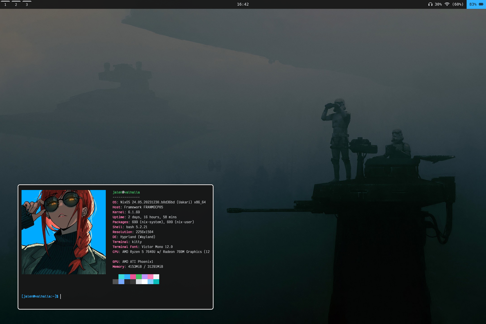

# Nix Dots 

I am revisiting NixOS after two/three long years full of macOS and Arch Linux (primarily the former unfortunately). This is my second major attempt with NixOS and it seems to be going much better (due to better hardware compatibility with different hardware). I am running this nix flake on a Framework 13 with a AMD 7040 series processor; my configuration choice thus reflect this. I will try to make the config as modular and usable to those without this laptop; let me know if there are any issues. 

## Impermanent Filesystem 

I have chosen to implement impermanence into my configuration. This is done the more "advanced" way as decribed [here](https://github.com/nix-community/impermanence). There are two partitions for my SSD: `boot` and `root`. The `boot` partition is the standard EFI setup using `fat32`. The `root` partition is a `btrfs` setup that mounts `/` to a subvolume `root`. On each reboot, the `root` subvolume is copied to a new timestamped subvolume (as a backup) and wiped. These backups are permanently deleted after 30 days from creation. I like this approach because if my system were to shutdown unexpectedly I have a convenient way to recover non-persisting files.  

## Tasks 

### Priority 

- [ ] Add root `default.nix`, so that the configuration can be used as a module for new NixOS installs.
- [ ] Remove hard-coded relative file/directory paths. Add configue options to define paths such as `/nix/persist`.
- [ ] Add install instructions to README.md. (Depends on root `default.nix`)
- [ ] Over-all file organization and make it consistent.

### Aesthetic

- [ ] Write scripts to display a notification when the brightness or volume are changed.
- [ ] Window shadows.

### Backlog

- [ ] Get screen sharing + Zoom working.
- [ ] Get HDMI working. 
