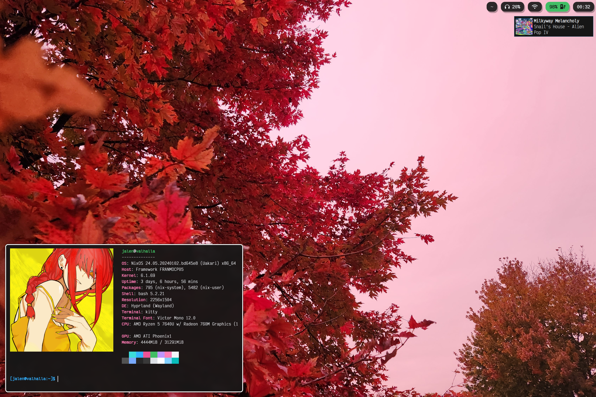

# Nix Dots 



I am revisiting NixOS after two/three long years full of macOS and Arch Linux (primarily the former unfortunately). This is my second major attempt with NixOS and it seems to be going much better (due to better hardware compatibility with different hardware). I am running this nix flake on a Framework 13 with a AMD 7040 series processor; my configuration choice thus reflect this. I will try to make the config as modular and usable to those without this laptop; let me know if there are any issues. 

## Impermanent Filesystem 

I have chosen to implement impermanence into my configuration. This is done the more "advanced" way as decribed [here](https://github.com/nix-community/impermanence). There are two partitions for my SSD: `boot` and `root`. The `boot` partition is the standard EFI setup using `fat32`. The `root` partition is a `btrfs` setup that mounts `/` to a subvolume `root`. On each reboot, the `root` subvolume is copied to a new timestamped subvolume (as a backup) and wiped. These backups are permanently deleted after 30 days from creation. I like this approach because if my system were to shutdown unexpectedly I have a convenient way to recover non-persisting files.

My reasoning for impermanence is to have complete control over the literal state of my system. In a traditonal personal computer, there comes a time where refreshing the computer is a must; there is simply too much conflicting state that has been saved over many months (or years!) which cause problems. Impermanence solves this problem by never having a large footprint other than important documents and state which I care to keep. For example, I do _not_ keep `~/.mozilla` or `~/Downloads` on reboot. The former is because browsers collect so much state and refreshing it is just good practice. The latter is to force myself to give new files a purpose, otherwise they are unimportant and non-persistent.

## Installation (WIP)

**NOTE**: Currently, it is _required_ to locally clone this repository and change at least the hardware/disk configuration.

From either the minimal/graphical NixOS iso, run the following as root while replacing `<hard-drive>` and `<usb>` as needed.

``` sh
parted /dev/<hard-drive> -- mklabel gpt
parted /dev/<hard-drive> -- mkpart primary 0% 100% # Reserve the entire hard drive for storage (not boot). 

parted /dev/<usb> -- mklabel gpt
parted /dev/<usb> -- mkpart ESP 1MB 512MB # boot partition
parted /dev/<usb> -- mkpart primary1 512MB 544MB # where the luks header will reside
parted /dev/<usb> -- mkpart primary2 544MB 100% # rest of the usb for storage. format as desired
```

The partition scheme should be setup now. To encrypt the hard-drive and extract the header to the usb drive, run:

``` sh
cryptsetup luksFormat /dev/<hard-drive>1 --type luks2 --header /dev/<usb>2 # answer prompts and provide password
cryptsetup luksOpen /dev/<hard-drive>1 crypted --header /dev/<usb>2 # open hard drive as /dev/mapper/crypted
```

Now we can format the necessary partitions.

``` sh
mkfs.fat -F 32 -n boot /dev/<usb>1
mkfs.btrfs /dev/<hard-drive>1
```

Now we can create our btrfs subvolumes.

``` sh
mkdir -p /tmp/drive
mount /dev/mapper/crypted -o compress-force=zstd,noatime,ssd /tmp/drive
cd /tmp/drive

btrfs subvolume create nix
btrfs subvolume create root
btrfs subvolume create backups
btrfs subvolume create persist
```

Now we mount these subvolumes as such:

``` sh
mount /dev/mapper/crypted -o compress-force=zstd,noatime,ssd,subvol=root /mnt

mkdir /mnt/{nix,persist,etc,etc/nixos,boot}

mount /dev/mapper/crypted -o compress-force=zstd,noatime,ssd,subvol=nix /mnt/nix
mount /dev/mapper/crypted -o compress-force=zstd,noatime,ssd,subvol=persist /mnt/persist

mount /dev/<usb>1 /mnt/boot
```

Now, we must either generate a config with `nixos-generate-config --root /mnt` or use flakes. I have done this the more annoying way by generating and replacing the config with the flake later. The flake option is the better one, but from here on out I am writting _untested_ instructions. I know it is non-standard, but I clone this repo to `/mnt/persist/dot` so I make sure any changes I make are not lost. This is a bit goofy, but I believe this is slightly "simpler" than generating a new hardware configuration:

*NOTE*: The following instructions have not been tested for re-producibilty. They are simply a _theoretically_ easier method of achieving my setup.

``` sh
nix-shell -p git # only if git is not present
cd /mnt/persist
git clone https://github.com/mjalen/dot

cd /mnt/persist/dot
blkid | grep "/dev/<hard-drive>1" # note the PARTUUID as <encryptedPARTUUID>
blkid | grep "/dev/<usb>2" # note the PARTUUID as <headerPARTUUID>
blkid | grep "/dev/<usb>1" # note the 8 digit UUID as <bootUUID>
blkid | grep "/dev/mapper/crypted" # note the UUID as <unencryptedUUID>
```

In the hardware file `/mnt/persist/dot/systems/config.nix`, update the PARTUUIDs and UUIDs are they are labeled.

``` nix
# line 8 ...
valhalla.hardware = {
    enabled = true;
    encryptedPARTUUID = "..."; # insert the corresponding values as strings.
    headerPARTUUID = "..."; # copy _only_ the hex ids and _not_ the full disk path.
    bootUUID = "...";
    unencryptedUUID = "...";
};
# ...
```

The last thing that is needed are user passwords. Simply run `mkdir -p /mnt/persist/psk` followed by

``` sh
cd /mnt/persist/psk
mkpasswd > root
mkpasswd > jalen # or whatever your user is named (if you edited the flake)
```

Then assuming flakes have been enabled (instructions TODO), from the flake directory `/mnt/persist/dot` run

``` sh
nixos-install --flake . --impure
```

## Tasks 

### Priority 

- [ ] Add root `default.nix`, so that the configuration can be used as a module for new NixOS installs.
- [ ] Remove hard-coded relative file/directory paths. Add configue options to define paths such as `/nix/persist`.
- [ ] Add install instructions to README.md. (Depends on root `default.nix`)
- [ ] Over-all file organization and make it consistent.

### Aesthetic

- [ ] Write scripts to display a notification when the brightness or volume are changed.
- [ ] Window shadows.

### Backlog

- [ ] Get screen sharing + Zoom working.
- [ ] Get HDMI working. 
